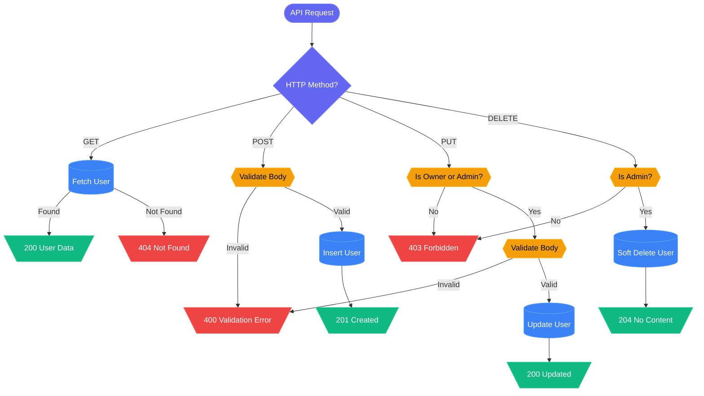

```mermaid
flowchart TD
    A([API Request]) --> B{HTTP Method?}

    B -->|GET| C[(Fetch User)]
    C -->|Found| D[\200 User Data/]
    C -->|Not Found| E[\404 Not Found/]

    B -->|POST| F{{"Validate Body"}}
    F -->|Invalid| G[\400 Validation Error/]
    F -->|Valid| H[(Insert User)]
    H --> I[\201 Created/]

    B -->|PUT| J{{Is Owner or Admin?}}
    J -->|No| K[\403 Forbidden/]
    J -->|Yes| L{{"Validate Body"}}
    L -->|Invalid| G
    L -->|Valid| M[(Update User)]
    M --> N[\200 Updated/]

    B -->|DELETE| O{{Is Admin?}}
    O -->|No| K
    O -->|Yes| P[(Soft Delete User)]
    P --> Q[\204 No Content/]

    classDef entry fill:#6366f1,stroke:#818cf8,color:#fff
    classDef validation fill:#f59e0b,stroke:#fbbf24,color:#000
    classDef data fill:#3b82f6,stroke:#60a5fa,color:#fff
    classDef success fill:#10b981,stroke:#34d399,color:#fff
    classDef error fill:#ef4444,stroke:#f87171,color:#fff

    class A,B entry
    class F,J,L,O validation
    class C,H,M,P data
    class D,I,N,Q success
    class E,G,K error
```
