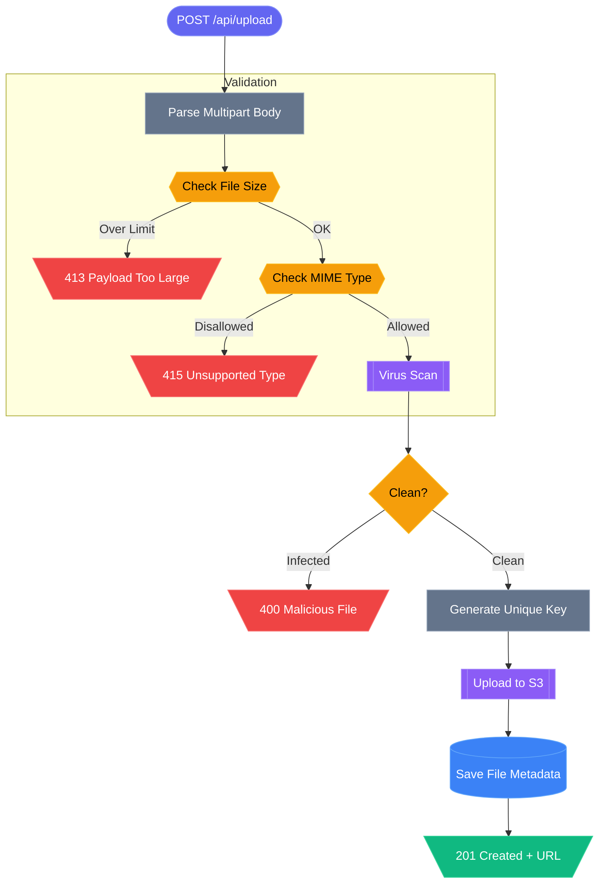

```mermaid
flowchart TD
    A([POST /api/upload]) --> B[Parse Multipart Body]

    subgraph Validation
        B --> C{{"Check File Size"}}
        C -->|Over Limit| D[\413 Payload Too Large/]
        C -->|OK| E{{"Check MIME Type"}}
        E -->|Disallowed| F[\415 Unsupported Type/]
        E -->|Allowed| G[[Virus Scan]]
    end

    G --> H{Clean?}
    H -->|Infected| I[\400 Malicious File/]
    H -->|Clean| J[Generate Unique Key]
    J --> K[[Upload to S3]]
    K --> L[(Save File Metadata)]
    L --> M[\201 Created + URL/]

    classDef entry fill:#6366f1,stroke:#818cf8,color:#fff
    classDef processing fill:#64748b,stroke:#94a3b8,color:#fff
    classDef validation fill:#f59e0b,stroke:#fbbf24,color:#000
    classDef external fill:#8b5cf6,stroke:#a78bfa,color:#fff
    classDef error fill:#ef4444,stroke:#f87171,color:#fff
    classDef data fill:#3b82f6,stroke:#60a5fa,color:#fff
    classDef success fill:#10b981,stroke:#34d399,color:#fff

    class A entry
    class B,J processing
    class C,E,H validation
    class G,K external
    class D,F,I error
    class L data
    class M success
```
