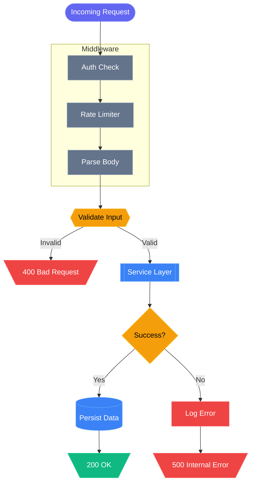

```mermaid
flowchart TD
    A([Incoming Request]) --> B

    subgraph Middleware
        B[Auth Check] --> C[Rate Limiter]
        C --> D[Parse Body]
    end

    D --> E{{"Validate Input"}}
    E -->|Invalid| F[\400 Bad Request/]
    E -->|Valid| G[[Service Layer]]
    G --> H{Success?}
    H -->|Yes| I[(Persist Data)]
    I --> J[\200 OK/]
    H -->|No| K[Log Error]
    K --> L[\500 Internal Error/]

    classDef entry fill:#6366f1,stroke:#818cf8,color:#fff
    classDef processing fill:#64748b,stroke:#94a3b8,color:#fff
    classDef validation fill:#f59e0b,stroke:#fbbf24,color:#000
    classDef success fill:#10b981,stroke:#34d399,color:#fff
    classDef error fill:#ef4444,stroke:#f87171,color:#fff
    classDef data fill:#3b82f6,stroke:#60a5fa,color:#fff

    class A entry
    class B,C,D processing
    class E,H validation
    class G,I data
    class J success
    class F,K,L error
```
