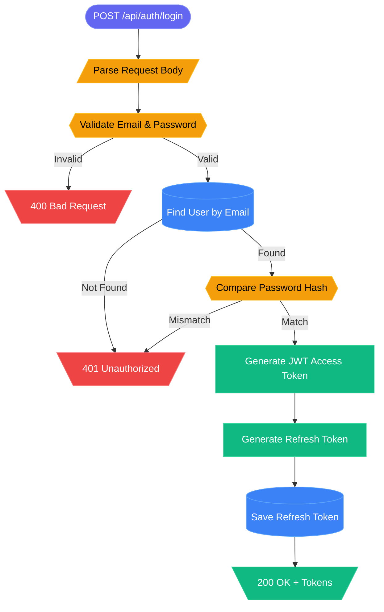

```mermaid
flowchart TD
    A([POST /api/auth/login]) --> B[/Parse Request Body/]
    B --> C{{"Validate Email & Password"}}
    C -->|Invalid| D[\400 Bad Request/]
    C -->|Valid| E[(Find User by Email)]
    E -->|Not Found| F[\401 Unauthorized/]
    E -->|Found| G{{Compare Password Hash}}
    G -->|Mismatch| F
    G -->|Match| H[Generate JWT Access Token]
    H --> I[Generate Refresh Token]
    I --> J[(Save Refresh Token)]
    J --> K[\200 OK + Tokens/]

    classDef entry fill:#6366f1,stroke:#818cf8,color:#fff
    classDef validation fill:#f59e0b,stroke:#fbbf24,color:#000
    classDef success fill:#10b981,stroke:#34d399,color:#fff
    classDef error fill:#ef4444,stroke:#f87171,color:#fff
    classDef data fill:#3b82f6,stroke:#60a5fa,color:#fff

    class A entry
    class B,C,G validation
    class H,I,K success
    class D,F error
    class E,J data
```
