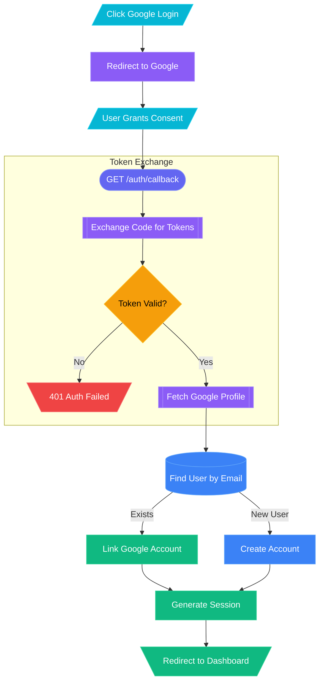

```mermaid
flowchart TD
    A[/Click Google Login/] --> B[Redirect to Google]
    B --> C[/User Grants Consent/]
    C --> D([GET /auth/callback])

    subgraph Token Exchange
        D --> E[[Exchange Code for Tokens]]
        E --> F{Token Valid?}
        F -->|No| G[\401 Auth Failed/]
        F -->|Yes| H[[Fetch Google Profile]]
    end

    H --> I[(Find User by Email)]
    I -->|Exists| J[Link Google Account]
    I -->|New User| K[Create Account]
    J --> L[Generate Session]
    K --> L
    L --> M[\Redirect to Dashboard/]

    classDef ui fill:#06b6d4,stroke:#22d3ee,color:#fff
    classDef entry fill:#6366f1,stroke:#818cf8,color:#fff
    classDef external fill:#8b5cf6,stroke:#a78bfa,color:#fff
    classDef validation fill:#f59e0b,stroke:#fbbf24,color:#000
    classDef error fill:#ef4444,stroke:#f87171,color:#fff
    classDef data fill:#3b82f6,stroke:#60a5fa,color:#fff
    classDef success fill:#10b981,stroke:#34d399,color:#fff

    class A,C ui
    class D entry
    class B,E,H external
    class F validation
    class G error
    class I,K data
    class J,L,M success
```
