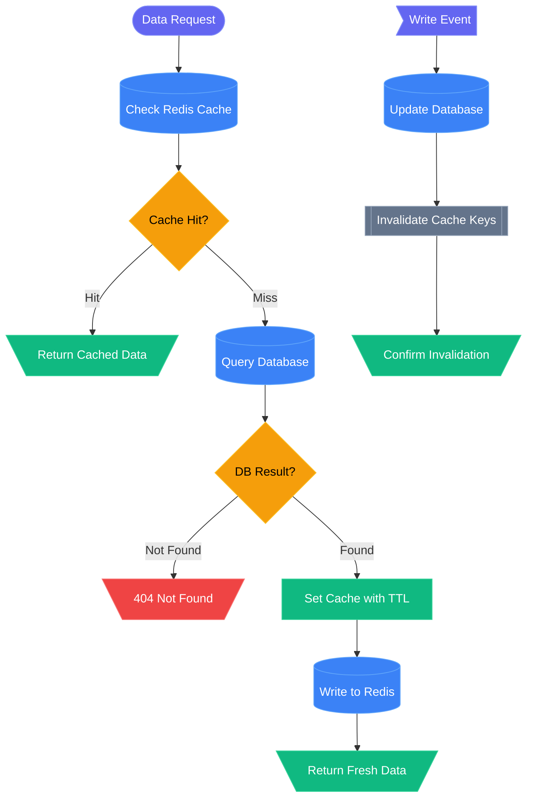

```mermaid
flowchart TD
    A([Data Request]) --> B[(Check Redis Cache)]
    B --> C{Cache Hit?}
    C -->|Hit| D[\Return Cached Data/]
    C -->|Miss| E[(Query Database)]
    E --> F{DB Result?}
    F -->|Not Found| G[\404 Not Found/]
    F -->|Found| H[Set Cache with TTL]
    H --> I[(Write to Redis)]
    I --> J[\Return Fresh Data/]

    K>Write Event] --> L[(Update Database)]
    L --> M[[Invalidate Cache Keys]]
    M --> N[\Confirm Invalidation/]

    classDef entry fill:#6366f1,stroke:#818cf8,color:#fff
    classDef data fill:#3b82f6,stroke:#60a5fa,color:#fff
    classDef validation fill:#f59e0b,stroke:#fbbf24,color:#000
    classDef success fill:#10b981,stroke:#34d399,color:#fff
    classDef error fill:#ef4444,stroke:#f87171,color:#fff
    classDef processing fill:#64748b,stroke:#94a3b8,color:#fff

    class A,K entry
    class B,E,I,L data
    class C,F validation
    class D,H,J,N success
    class G error
    class M processing
```
