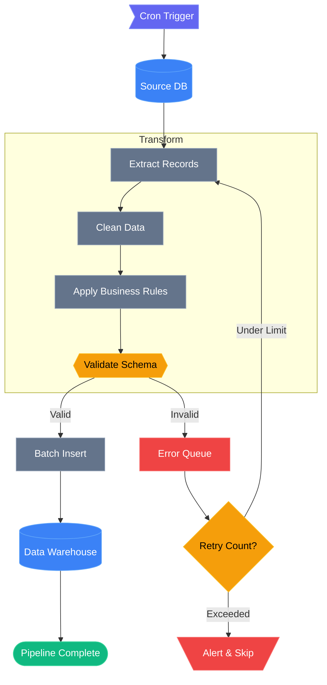

```mermaid
flowchart TD
    A>Cron Trigger] --> B[(Source DB)]
    B --> C[Extract Records]

    subgraph Transform
        C --> D[Clean Data]
        D --> E[Apply Business Rules]
        E --> F{{"Validate Schema"}}
    end

    F -->|Valid| G[Batch Insert]
    G --> H[(Data Warehouse)]
    H --> I([Pipeline Complete])
    F -->|Invalid| J[Error Queue]
    J --> K{Retry Count?}
    K -->|Under Limit| C
    K -->|Exceeded| L[\Alert & Skip/]

    classDef entry fill:#6366f1,stroke:#818cf8,color:#fff
    classDef data fill:#3b82f6,stroke:#60a5fa,color:#fff
    classDef processing fill:#64748b,stroke:#94a3b8,color:#fff
    classDef validation fill:#f59e0b,stroke:#fbbf24,color:#000
    classDef success fill:#10b981,stroke:#34d399,color:#fff
    classDef error fill:#ef4444,stroke:#f87171,color:#fff

    class A entry
    class B,H data
    class C,D,E,G processing
    class F,K validation
    class I success
    class J,L error
```
