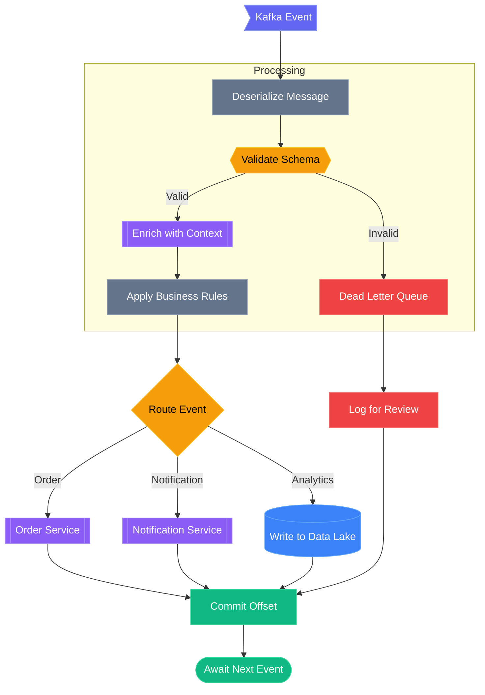

```mermaid
flowchart TD
    A>Kafka Event] --> B[Deserialize Message]

    subgraph Processing
        B --> C{{"Validate Schema"}}
        C -->|Invalid| D[Dead Letter Queue]
        C -->|Valid| E[[Enrich with Context]]
        E --> F[Apply Business Rules]
    end

    F --> G{Route Event}
    G -->|Order| H[[Order Service]]
    G -->|Notification| I[[Notification Service]]
    G -->|Analytics| J[(Write to Data Lake)]

    H --> K[Commit Offset]
    I --> K
    J --> K
    D --> L[Log for Review]
    L --> K
    K --> M([Await Next Event])

    classDef entry fill:#6366f1,stroke:#818cf8,color:#fff
    classDef processing fill:#64748b,stroke:#94a3b8,color:#fff
    classDef validation fill:#f59e0b,stroke:#fbbf24,color:#000
    classDef external fill:#8b5cf6,stroke:#a78bfa,color:#fff
    classDef data fill:#3b82f6,stroke:#60a5fa,color:#fff
    classDef error fill:#ef4444,stroke:#f87171,color:#fff
    classDef success fill:#10b981,stroke:#34d399,color:#fff

    class A entry
    class B,F processing
    class C,G validation
    class E,H,I external
    class J data
    class D,L error
    class K,M success
```
