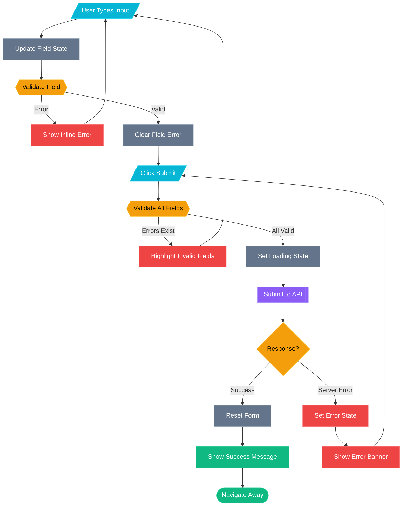

```mermaid
flowchart TD
    A[/User Types Input/] --> B[Update Field State]
    B --> C{{"Validate Field"}}
    C -->|Error| D[Show Inline Error]
    D --> A
    C -->|Valid| E[Clear Field Error]
    E --> F[/Click Submit/]
    F --> G{{"Validate All Fields"}}
    G -->|Errors Exist| H[Highlight Invalid Fields]
    H --> A
    G -->|All Valid| I[Set Loading State]
    I --> J[[Submit to API]]
    J --> K{Response?}
    K -->|Success| L[Reset Form]
    L --> M[Show Success Message]
    M --> N([Navigate Away])
    K -->|Server Error| O[Set Error State]
    O --> P[Show Error Banner]
    P --> F

    classDef ui fill:#06b6d4,stroke:#22d3ee,color:#fff
    classDef processing fill:#64748b,stroke:#94a3b8,color:#fff
    classDef validation fill:#f59e0b,stroke:#fbbf24,color:#000
    classDef external fill:#8b5cf6,stroke:#a78bfa,color:#fff
    classDef success fill:#10b981,stroke:#34d399,color:#fff
    classDef error fill:#ef4444,stroke:#f87171,color:#fff

    class A,F ui
    class B,E,I,L processing
    class C,G,K validation
    class J external
    class M,N success
    class D,H,O,P error
```
