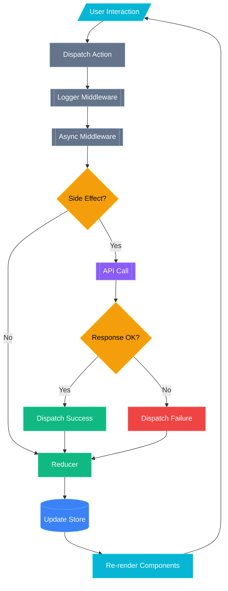

```mermaid
flowchart TD
    A[/User Interaction/] --> B[Dispatch Action]
    B --> C[[Logger Middleware]]
    C --> D[[Async Middleware]]
    D --> E{Side Effect?}
    E -->|Yes| F[[API Call]]
    F --> G{Response OK?}
    G -->|Yes| H[Dispatch Success]
    G -->|No| I[Dispatch Failure]
    E -->|No| J[Reducer]
    H --> J
    I --> J
    J --> K[(Update Store)]
    K --> L[Re-render Components]
    L --> A

    classDef ui fill:#06b6d4,stroke:#22d3ee,color:#fff
    classDef processing fill:#64748b,stroke:#94a3b8,color:#fff
    classDef external fill:#8b5cf6,stroke:#a78bfa,color:#fff
    classDef validation fill:#f59e0b,stroke:#fbbf24,color:#000
    classDef success fill:#10b981,stroke:#34d399,color:#fff
    classDef error fill:#ef4444,stroke:#f87171,color:#fff
    classDef data fill:#3b82f6,stroke:#60a5fa,color:#fff

    class A,L ui
    class B,C,D processing
    class E,G validation
    class F external
    class H,J success
    class I error
    class K data
```
