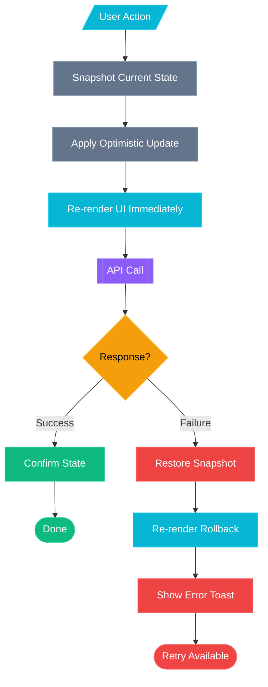

```mermaid
flowchart TD
    A[/User Action/] --> B[Snapshot Current State]
    B --> C[Apply Optimistic Update]
    C --> D[Re-render UI Immediately]
    D --> E[[API Call]]
    E --> F{Response?}
    F -->|Success| G[Confirm State]
    G --> H([Done])
    F -->|Failure| I[Restore Snapshot]
    I --> J[Re-render Rollback]
    J --> K[Show Error Toast]
    K --> L([Retry Available])

    classDef ui fill:#06b6d4,stroke:#22d3ee,color:#fff
    classDef processing fill:#64748b,stroke:#94a3b8,color:#fff
    classDef external fill:#8b5cf6,stroke:#a78bfa,color:#fff
    classDef validation fill:#f59e0b,stroke:#fbbf24,color:#000
    classDef success fill:#10b981,stroke:#34d399,color:#fff
    classDef error fill:#ef4444,stroke:#f87171,color:#fff

    class A,D,J ui
    class B,C processing
    class E external
    class F validation
    class G,H success
    class I,K,L error
```
